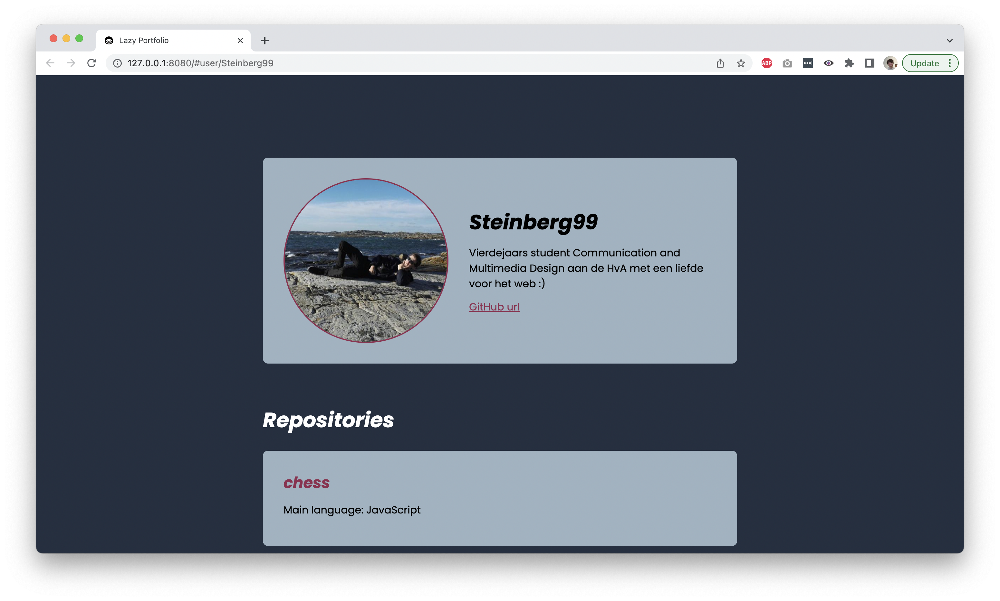

# Lazy Portfolio!

This repository hosts a small webapp that displays information from GitHub profiles. Users can enter their own username in the url or search for their profile with the search bar. This way they can create their own "lazy" portfolio page.

## Example profile

## Live Site

View the live site [here](https://steinberg99.github.io/portfolio-2/).

## Description

Welcome! For the first project of the minor [Web Design and Development](https://everythingweb.org/) we had to create a small portfolio page that used the GitHub api. I thought it would be fun to create a portfolio page that could be used by multiple people. On the site users can enter their own GitHub handle to customize the page based on their accounts.

## Installation

> **NOTE:** Before you can install this project be sure you have [Git](https://git-scm.com/) and [npm](https://www.npmjs.com/) installed on your local machine!

To install this project on your local machine clone the repository by running the following command:

`git clone https://github.com/Steinberg99/portfolio-2`

After running this command you should run `npm install` to install the necessary packages. Now run `npm start` to start the project.

# License

MIT License
